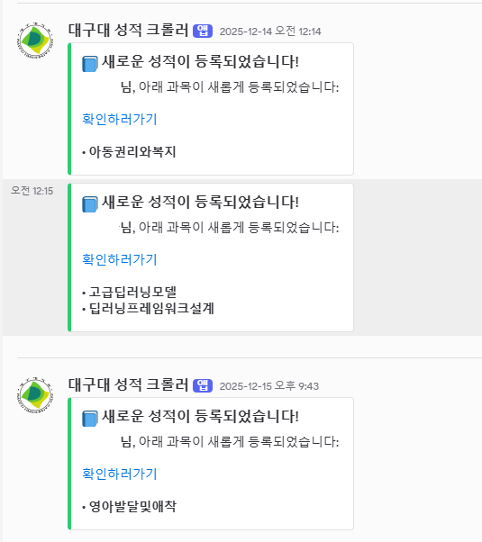
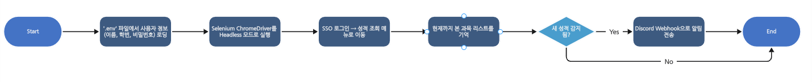

# GradeDetecter
성적 발표를 자동으로 감지해서 Discord Webhook으로 알림을 보내는 Python 기반 자동화 도구

## 실제 사용 사례

## 프로젝트 개요
gradeDetecter는 대구대학교의 성적 포털에서 사용자별로 새로운 성적이 등록되는지 주기적으로 체크하고, 새로운 성적이 감지되면 Discord Webhook을 통해 알림을 보내주는 자동화 프로그램입니다.

Python과 Selenium을 사용해 로그인 → 성적 페이지 접근 → 성적 변경 감지를 수행합니다.

## 주요 기능
- 학교 성적 포털 로그인 자동화
- 성적 목록 크롤링 및 “새로운 성적” 감지
- 알림을 Discord 서버로 전송
- 여러 사용자 계정 동시에 처리
- 3시간 간격으로 반복 실행

## 동작 방식

## 필수 설정
프로젝트 루트에 아래와 같은 환경 변수를 설정한 .env 파일이 필요합니다:

### 사용자별 정보(JSON 형태)
USER1='{"name":"홍길동","id":"202012345","passwd":"password123"}'
USER2='{"name":"김철수","id":"201987654","passwd":"pass456"}'

### 파일 구조
gradeDetecter/
├── crawler.py        # 성적 웹 크롤링 로직
├── main.py           # 메인 실행 모듈
├── .env              # 환경변수 설정
├── dockerfile        # 도커 이미지 구성 (옵션)
├── __pycache__/
├── requirements.txt  # 파이썬 의존성
🧩 crawler.py 개요